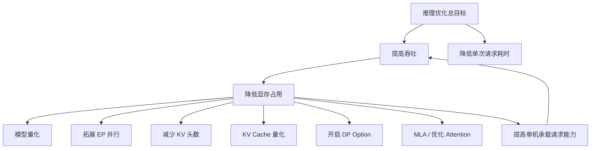

# 大模型推理公开课笔记

---

## 核心总目标

> **推理优化的总目标：提高吞吐，降低单次请求耗时。**
>
> 提升吞吐的核心逻辑：**降低显存占用 → 提高单机能承载的并发请求数 → 提升整体吞吐**。
>
> 因为推理系统（尤其是 Decode 阶段）是**显存带宽受限**的任务，显存是最大瓶颈。谁能让每张卡"塞进"更多请求，谁就赢了。



## 一、基础概念速查

### 1.1 并行策略术语

| 缩写 | 全称 | 含义 |
|------|------|------|
| **DP** | Data Parallelism（数据并行） | 将同一份模型复制到多张卡上，每张卡处理不同的数据 batch，最后汇总梯度。训练和推理中都可以使用。 |
| **TP** | Tensor Parallelism（张量并行） | 将模型的一层（如矩阵乘法）拆分到多张卡上并行计算，每张卡算一部分，通过 AllReduce 通信合并结果。适合单层计算量大的场景。 |
| **EP** | Expert Parallelism（专家并行） | 由 DeepSeek 在 MoE 模型中推广。将 MoE 中的不同专家（Expert）分布到不同的 GPU 上，每个 token 根据路由结果只激活部分专家，对应的 GPU 才参与计算。 |
| **CP** | Context Parallelism（上下文并行） | 将长序列的上下文维度切分到多张卡上，每张卡处理序列的一段，通过通信交换 KV 信息，解决超长序列下单卡显存不够的问题。 |
| **PD 分离** | Prefill-Decode 分离 | 将推理的 Prefill 阶段（一次性处理所有输入 token，计算密集）和 Decode 阶段（逐 token 生成，访存密集）部署在不同的机器/GPU 上，各自优化，互不干扰。 |

### 1.2 PB 分离是什么？

> **PB = Prefill-Batch**，即 Prefill 阶段的批处理策略。
>
> 从 Attention 原理来理解：Prefill 阶段需要一次性计算所有输入 token 的 QKV 矩阵并做注意力计算，计算量与输入长度的平方成正比（标准 Attention 复杂度 O(n²)）。当多个请求同时到达时，如何对这些请求做 batch 就决定了 GPU 的利用率。PB 分离的核心思想是将 Prefill 的批处理调度独立出来，与 Decode 阶段的批处理解耦，避免互相抢占资源。

### 1.3 专家数是什么？

> 在 MoE（Mixture of Experts）架构中，每一层包含多个"专家"（Expert），每个专家本质上是一个独立的前馈网络（FFN）。
>
> **专家数**就是每层中 FFN 的数量。例如 DeepSeek-V3 每层有 256 个专家，但每个 token 只激活其中 8 个（Top-K 路由）。专家数越多，模型容量越大，但路由和通信开销也越高。EP 并行就是将这些专家分散到不同 GPU 上。

---

## 二、推理性能指标

### 2.1 核心耗时公式

```
总耗时 = TTFT + TPOT × OSL
```

| 指标 | 全称 | 含义 |
|------|------|------|
| **TTFT** | Time To First Token | 首 token 延迟，即从请求发出到收到第一个输出 token 的时间。主要受 Prefill 阶段影响。 |
| **TPOT** | Time Per Output Token | 每个输出 token 的生成耗时。主要受 Decode 阶段影响。 |
| **OSL** | Output Sequence Length | 输出序列的总 token 长度。 |

### 2.2 各阶段的优化方向

| 阶段 | 瓶颈 | 优化方案 |
|------|------|----------|
| **Prefill（影响 TTFT）** | 大量输入 token 的一次性计算 | prefix cache（以存代算）、上下文并行（CP）、算子优化 |
| **Decode（影响 TPOT）** | 逐 token 生成，受限于显存带宽 | 投机解码（Speculative Decoding）、PD 分离、算子优化 |
| **整体** | 吞吐与延迟的平衡 | 并行策略（TP/CP）、流量调度、连续批处理 |

> **投机解码补充**：用一个小的"草稿模型"快速生成多个候选 token，再用大模型一次性验证。如果验证通过，相当于一步生成了多个 token，大幅降低 TPOT。

---

## 三、大模型吞吐（Throughput）

### 3.1 吞吐的定义

吞吐是指推理系统在单位时间内处理的 token 总量，通常用 **tokens/s** 来衡量。

吞吐有两个维度：
- **输入吞吐（Input Throughput）**：系统每秒处理的输入 token 数（Prefill 阶段）
- **输出吞吐（Output Throughput）**：系统每秒生成的输出 token 数（Decode 阶段）

实际衡量系统能力时，通常关注**输出吞吐**，因为生成 token 是更耗资源的阶段。

### 3.2 吞吐与延迟、效率的关系

```
                  ┌─────────────────────────────────┐
                  │        系统吞吐 (tokens/s)        │
                  │  = 并发请求数 × 单请求 token/s    │
                  └─────────┬───────────┬────────────┘
                            │           │
                ┌───────────▼──┐  ┌─────▼──────────────┐
                │   延迟(单请求) │  │   效率(GPU利用率)    │
                │  TTFT + TPOT │  │  算力是否被充分利用   │
                └──────────────┘  └────────────────────┘
```

**三者的核心矛盾：**

| 关系 | 说明 |
|------|------|
| **吞吐 vs 延迟** | 增大 batch size 可以提高吞吐（更多请求并行），但每个请求分到的算力变少，TPOT 上升，延迟变差。这是推理系统最核心的 trade-off。 |
| **吞吐 vs 效率** | 吞吐高不等于效率高。如果 GPU 的算力利用率低（比如大量时间在等通信或访存），即使并发多，吞吐也上不去。反过来，高效利用算子是提升吞吐的基础。 |
| **效率 vs 延迟** | 提高效率（如算子融合、减少冗余计算）可以同时改善吞吐和延迟，是最理想的优化方向，但优化空间有限。 |

> **一句话总结**：吞吐是系统级指标（全局），延迟是用户级指标（单个请求），效率是硬件级指标（GPU 利用率）。三者不可能同时最优，工程上需要根据业务场景做取舍——在线服务优先保延迟，离线批处理优先保吞吐。

### 3.3 如何提升吞吐

> **核心思路：降低显存占用 → 同一台机器能承载更多并发请求 → 吞吐上升**

#### 降低显存占用（提升并发容量）

| 方法 | 原理 | 效果 |
|------|------|------|
| **模型量化** | 将 FP16/BF16 权重压缩为 INT8/INT4，模型体积直接减半甚至更多 | 显存占用大幅降低，同卡可服务更多请求 |
| **拓展 EP（专家并行）** | MoE 模型中将更多专家分布到更多 GPU 上，单卡只加载部分专家 | 单卡显存压力分散，整体可承载更大 batch |
| **减少 KV 头数** | 使用 GQA/MQA 减少 Key-Value 头数量（如从 MHA 的 64 头减到 8 头） | KV Cache 体积直接按头数比例缩小 |
| **KV Cache 量化** | 将 KV Cache 从 FP16 量化到 INT8/FP8 | KV Cache 显存占用减半，是 Decode 阶段最直接的优化 |
| **开启 DP Option** | 在推理框架中开启数据并行选项，多卡各自处理不同请求 | 线性扩展吞吐容量 |
| **MLA（Multi-head Latent Attention）** | DeepSeek 提出的注意力优化，将 KV 压缩到低维潜在空间 | KV Cache 体积大幅缩小（相比 MHA 可降 90%+） |

#### 提升计算效率（充分利用算力）

1. **连续批处理（Continuous Batching / Inflight Batching）**：新请求可以随时插入正在运行的 batch，不用等当前 batch 全部结束，大幅提高 GPU 利用率。

   **原理详解：为什么单模型能处理高并发？**

   > **串行的是“token”，不是“请求”**——这是理解推理并发的关键。

   Decode 阶段虽然是逐 token 串行生成，但多个请求可以在同一个 Decode step 中 **并行计算**：

   ```
   传统方式（Static Batching，低效）：
   请求A: ████████░░░░░░░░
   请求B: ░░░░░░░░████████
                                 ↑ A做完才做B，GPU大量空闲

   Continuous Batching（高效）：
   请求A: ████████░░░░░░░░
   请求B: ░░████████░░░░░░
   请求C: ░░░░░░██████████
                                 ↑ 多个请求重叠在GPU上同时跑
   ```

   **每个 Decode step 的执行流程：**
   ```
   Step 1: [请求A的第1个token, 请求B的第1个token, 请求C的第1个token] → 一次前向
   Step 2: [请求A的第2个token, 请求B的第2个token, 请求C的第2个token] → 一次前向
   Step 3: [请求A的第3个token, 请求B生成EOS结束!, 请求C的第3个token] → B退出
   Step 4: [请求A的第4个token, 新请求D动态插入!,    请求C的第4个token] → D补位
   ```

   **并发能力的三个层面：**

   | 层面 | 串行还是并行 | 说明 |
   |------|------------|------|
   | 单个请求内部 | 串行 | 第 n+1 个 token 依赖第 n 个 |
   | 多个请求之间 | 并行 | 同一个 step 里 batch 一起算 |
   | 请求生命周期 | 动态 | EOS 后立即有新请求插入 |

   **主流推理引擎支持：**
   - **vLLM** — PagedAttention + Continuous Batching
   - **TensorRT-LLM** — In-flight Batching
   - **TGI** — Continuous Batching
2. **增大 batch size**：更多请求并行处理，但有延迟代价。
3. **PD 分离**：Prefill 和 Decode 各自用最适合的硬件和 batch 策略，整体吞吐更高。
4. **KV Cache 管理优化**：减少显存碎片（如 PagedAttention），同一显存空间能服务更多并发请求。
5. **算子融合与优化**：减少 kernel launch 开销和冗余访存。
6. **负载均衡与调度**：将请求合理分配到各节点，避免部分 GPU 空闲。

> **小 EP 场景下的特殊情况**：当 EP 数较小时（如 EP=2 或 4），随着吞吐上升（batch 变大），不同 token 路由到同一个专家的概率增加，导致部分 GPU 负载过重，其他 GPU 空等，**性能反而可能下降**。这就是 MoE 推理中 EP 规模与吞吐的矛盾。

---

## 四、缓存策略

### 4.1 三级缓存体系

```
单机缓存 → 分布式缓存 → 显式缓存
（最快）    （可扩展）    （最省显存）
```

#### 单机缓存
- 每台机器用本地显存存储 KV Cache
- **优点**：访问速度快，无需网络传输
- **缺点**：显存容量有限，多轮对话轮次增加后容量不足；负载不均衡，有的机器缓存多有的少

#### 分布式缓存
- 构造一个全局缓存池，P 节点（Prefill）和 D 节点（Decode）都可以注册和访问
- 通过 **RDMA 高速网络**在节点间搬迁 KV Cache 数据
- **触发场景**：单轮对话转向多轮对话后，缓存需求明显上涨
- **关键 trade-off**：需要评估缓存长度——如果搬数据的耗时高于重新计算的耗时，那就不如直接重算，不搬

#### 显式缓存
- 明确知道 system prompt 等固定前缀的位置，**显式指定缓存区域**
- 只缓存有价值的内容，避免保存无用的 KV，节省显存
- 适合 system prompt 较长且固定的场景（如角色扮演、工具调用模板）

---

## 五、DeepSeek 模型结构与推理优化

### 5.1 长尾效应与上下文并行

- DeepSeek 采用 MoE 架构，不同 token 激活的专家不同，导致各 GPU 的计算量不均匀（**长尾效应**：少量专家被频繁调用，大量专家偶尔才被调用）
- 在 Attention 计算中，QKV 三个矩阵相乘时，**后面的 token 依赖前面所有 token 的 KV 值**，越往后计算量越大

### 5.2 负载均衡策略

- **投影操作可以纯并行**，与上下文无关，权重通过通信合并
- 将计算量最大和最小的 token **放在一起计算**（打包调度），使各 GPU 算力使用更均衡
- 这一优化能有效降低 TTFT

### 5.3 DP + MLA 工作模式

- **MLA（Multi-head Latent Attention）**：DeepSeek 提出的注意力优化，将 KV 压缩到低维潜在空间，大幅减少 KV Cache 的显存占用
- 工作模式：**优先计算 Attention，再计算其他部分**（如 FFN/MoE），充分利用 MLA 的低显存特性

---

## 六、流量调度

### 6.1 请求级调度

| 策略 | 说明 |
|------|------|
| **连续批处理 + 优先级** | 在 Continuous Batching 中优先处理高优先级请求 |
| **客户端断联终止** | 客户端断开后立即终止生成，避免无效请求占用 GPU 资源。因此推荐使用**流式请求**调用，断联后能及时停止，避免持续计费 |

### 6.2 序列级调度

| 策略 | 说明 |
|------|------|
| **长短序列分离** | 长序列长时间占用机器，短序列很快释放。将资源分区，分别处理长短序列 |
| **多轮对话亲和调度** | 将同一个用户的多轮对话调度到同一台机器，缓存命中率最高 |

### 6.3 集群级调度

| 策略 | 说明 |
|------|------|
| **负载均衡** | 不做负载均衡时，可能因为某节点 KV Cache 不够导致请求失败；最慢的卡会拖累整个集群效率 |
| **高低优先级分离** | 当 C 端业务资源有限时，高优请求和低优请求分开处理，保障核心业务 SLA |

> **关键认知**：请求之间的差异天生很大（输入长度、输出长度、优先级各不相同），不做调度的"先来先服务"策略在大规模场景下效率很低。丰富的调度策略是推理系统从"能用"到"好用"的关键。
